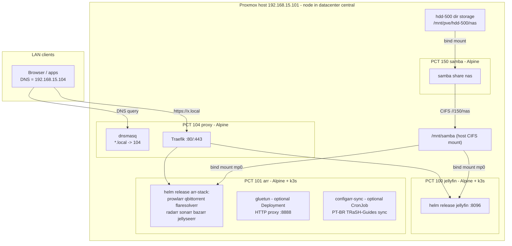

# Design — homelab-foundation

## Overview

Two-layer IaC: **OpenTofu** (bpg/proxmox provider) owns container lifecycle on
the Proxmox node; **Ansible** owns everything inside containers and the one
host-level concern (the CIFS mount). The existing containers (100, 101, 150)
are being deleted and recreated from this spec rather than imported — the
only thing that must survive the rebuild is the hdd-500 NAS data (see Key
decision 4). A new proxy container (Traefik + dnsmasq) provides
`https://<service>.local` for the LAN.



## Inventory of managed resources

| PCT | Name     | OS        | IP (static)        | CPU | RAM/Swap MB | Rootfs (local-lvm) | Extra storage |
|-----|----------|-----------|--------------------|-----|-------------|--------------------|---------------|
| 100 | jellyfin | Alpine + k3s | 192.168.15.102/24  | 2   | 4096/512    | 16 GB              | bind: host `/mnt/samba` → `/mnt/samba`; iGPU passthrough (`/dev/dri/renderD128`, `/dev/dri/card1`) for QSV transcode |
| 101 | arr      | Alpine    | 192.168.15.103/24  | 4   | 6144/512    | 12 GB (k3s + images) | bind: host `/mnt/samba` → `/mnt/samba`; `/dev/net/tun` passthrough |
| 150 | samba    | Alpine    | 192.168.15.150/24  | 4   | 2048/512    | 4 GB               | bind: host `/mnt/pve/hdd-500/nas` → `/srv/nas` |
| 104 | proxy    | Alpine    | 192.168.15.104/24  | 1   | 512/512     | 2 GB               | none (deliberately NAS-independent) |

All unprivileged. Gateway `192.168.15.1`, bridge `vmbr0` (variables). These
sizes are the target for the from-scratch rebuild (containers 100/101/150
are deleted and recreated, not imported) — they don't need to match whatever
footprint the old containers happened to grow into.

## Key decisions

1. **CIFS is mounted on the Proxmox host, bind-mounted into containers.**
   Unprivileged LXC cannot mount CIFS (no `CAP_SYS_ADMIN` in the user
   namespace). The existing fstab line (`uid=100000,gid=110000,...`) already
   implies this pattern: host uid 100000 = container root, host gid 110000 =
   container gid 10000. That is why every service runs with `PGID=10000` — group
   `10000` inside a container gets rw via `file_mode=0660,dir_mode=0770`.
   The jellyfin system user is therefore added to a group with gid 10000.

2. **`nobrl` added to the CIFS mount options.** Service configs (SQLite DBs for
   the arr apps and jellyfin) move onto the share per requirement 2.2. SQLite
   over CIFS fails on byte-range locks; `nobrl` disables them. Residual risk:
   SQLite-on-network-share is never as robust as local disk — accepted
   trade-off for centralized config, called out here deliberately.

3. **Proxy container does not depend on the NAS.** Traefik/dnsmasq config is
   fully declarative from this repo (Ansible templates), so storing it on samba
   adds a dependency cycle (DNS/proxy down when NAS is down) for zero benefit.
   Requirement 2.2 is interpreted as applying to *stateful* service config.

4. **Delete-and-recreate, not import.** PCT 100/101/150 predate this repo and
   drifted from it (ad-hoc resizing, a community-script install on 100, an
   undocumented GPU passthrough hand-added to 101 that nothing consumes).
   Rather than reconciling tofu to match that drift, the containers are
   deleted and recreated fresh via `tofu apply` so they exactly match this
   spec. `lifecycle { prevent_destroy = true }` guards them once created (a
   destructive plan errors out); there's no `ignore_changes` on
   `operating_system` because a freshly created container's OS genuinely
   matches what's declared — no imported-template ambiguity to ignore.
   **Data safety is the one hard constraint on the delete step**: hdd-500
   currently backs PCT 150's rootfs disk directly (`pct config 150` shows
   `rootfs: hdd-500:150/vm-150-disk-0.raw,size=458G`, no separate mount) —
   simply destroying that container would destroy the NAS payload with it.
   Before deleting PCT 150, the real directory tree must be copied out of
   that raw disk image onto `/mnt/pve/hdd-500/nas` — a *subdirectory* of
   hdd-500, not its bare root, so PVE's own `images/`/`template/`/`dump/`
   folders on that storage don't end up inside the samba share (`pct mount
   150` + `rsync`, full runbook in tasks.md 4.3 — including a preflight
   space check, since the copy temporarily needs ~2x the data size free on
   hdd-500 until the old disk is deleted). The freshly recreated PCT 150 —
   built per Requirement 2.1, with a small local-lvm rootfs and
   `hdd500_host_path` (`/mnt/pve/hdd-500/nas`) bind-mounted at `/srv/nas` —
   then reattaches to already-populated data instead of an empty share.
   PCT 100 and 101 are *not* data-free either: jellyfin's
   `/etc/jellyfin` + `/var/lib/jellyfin` (library metadata, watch history,
   users) and arr's legacy `/srv/<service>/config` dirs are still local to
   those containers today, not yet on the samba share. `migrate-configs.yml`
   already does exactly this copy (stop service → rsync to
   `configs_root` → leave source untouched) — it must be run against the
   *existing* PCT 100/101 before they're deleted, not after the rebuild. Once
   migrated, the fresh containers (with `/mnt/samba` bind-mounted from the
   start) find their config already on the share and never fresh-initialize
   into an empty state. Order: `migrate-configs.yml` against old 100/101 →
   extract hdd-500's data out of 150's disk image → delete 100/101/150 →
   `tofu apply` → `bootstrap.yml`/`storage.yml`/`site.yml` against the new
   containers.

5. **gluetun is an independent egress *service*, not a network wrapper.**
   Considered and rejected: (a) sharing gluetun's network namespace with
   qbittorrent (the compose `network_mode: service:gluetun` pattern / a k8s
   pod-level sidecar) — couples qbittorrent's entire network to gluetun's
   lifecycle, violating the hard constraint that qbittorrent never depends on
   gluetun; (b) routing the whole arr LXC through the VPN — same problem,
   amplified: *every* service including web UIs would break when the tunnel is
   down. Chosen design: gluetun is its own Deployment + LoadBalancer Service,
   rendered only when the Helm value `gluetun.enabled` is true, publishing an
   HTTP proxy on `:8888` (`HTTPPROXY=on`). Applications that want VPN egress
   opt in through their own proxy settings (qBittorrent → Settings →
   Connection → Proxy → `192.168.15.103:8888`); flipping that app setting is
   the only integration point. Every other workload's manifest is
   byte-identical whether gluetun is on or off. Note: if an app was pointed at
   the proxy and gluetun is later disabled, that app's own proxy setting must
   be unset — inherent to app-level opt-in, documented in the runbook.
   Credentials flow Vault → Ansible-rendered values file (0600 on PCT 101) →
   k8s Secret (`envFrom`). It needs `NET_ADMIN` + `/dev/net/tun` (hostPath);
   OpenTofu passes `/dev/net/tun` into PCT 101 unconditionally (harmless while
   unused; PVE 8 `dev0` passthrough works for unprivileged containers).

6. **`.local` as requested, with eyes open.** `.local` collides with
   mDNS/Bonjour (RFC 6762); some clients (Apple, some Linux resolvers) may
   bypass unicast DNS for it. Accepted per PLAN.md; if it bites, switch the
   dnsmasq/Traefik domain variable to `.lan` or `.home.arpa` — it is a single
   variable change.

7. **Self-signed TLS.** Traefik serves its default cert; browsers warn once.
   A local CA (mkcert/step-ca) is a future spec.

8. **arr runs on k3s inside the unprivileged LXC; deployed by a repo-local
   Helm chart.** k3s (single node, server mode) is the smallest practical k8s.
   Unprivileged-LXC accommodations, all encoded in the `k3s` role:
   `nesting=1` (keyctl turned out unneeded for k3s/containerd — dropped after
   `pct config 101` showed the live container never actually had it set), a
   `/dev/kmsg` shim
   (`/etc/local.d`, symlink to `/dev/console` — kubelet insists on it),
   `kubelet-arg: feature-gates=KubeletInUserNamespace=true` (tolerates missing
   cgroup/kernel access in a user namespace),
   `kube-proxy-arg: conntrack-max-per-core=0` (sysctls are read-only in the
   userns), and a `cgroup-delegate` OpenRC service (`/etc/init.d`, `before
   k3s` in its `depend()`) — Alpine has no systemd to delegate cgroup v2
   controllers to child cgroups on boot the way it would on a systemd host,
   so without this kubelet's `ContainerManager` fails to create its
   `kubepods` cgroup (`cgroup ["kubepods"] has some missing controllers`) and
   k3s crash-loops every ~5s indefinitely (found by diagnosing PCT 100 doing
   exactly that: `wait_for: port 6443` passed once, then `helm upgrade
   --install` hit connection-refused because the API server had already died
   again). The service does two things, in order: migrates every process
   already in the root cgroup into a leaf (`/sys/fs/cgroup/init`) — cgroup v2
   refuses to enable controllers in a cgroup's `subtree_control` while it
   still holds member processes directly, and nothing else ever moves them
   out on Alpine — then writes `+cpuset +cpu +hugetlb +memory +pids` into
   the now-empty root's `subtree_control` so kubelet can create `kubepods`
   under it. Bundled traefik and metrics-server are
   disabled — ingress lives in
   the proxy CT and RAM is scarce. k3s + helm come from Alpine's community
   repo (no curl-pipe installers). Services are exposed on the node IP at the
   legacy ports via k3s servicelb (LoadBalancer), so the proxy CT and LAN
   clients see no difference from the compose era. The chart is local to this
   repo (`kubernetes/charts/arr-stack`) — no third-party chart dependency, one
   `values.yaml` as the single source of app wiring. Known risks, accepted:
   k3s in an unprivileged LXC is the least-trodden path in this design (if
   overlayfs snapshotter misbehaves, set `snapshotter: native` in
   `/etc/rancher/k3s/config.yaml`). k3s server overhead (~700 MB) plus seven
   app pods was tight against the original 4 GB default — `arr_memory`
   defaults to 6144 now. `tzdata` is installed alongside `k3s`/`helm` for the
   same reason as the other accommodations here: Alpine doesn't ship IANA
   zoneinfo by default, and k3s's Go runtime needs `/usr/share/zoneinfo` to
   validate a `CronJob`'s `spec.timeZone` (found via the configarr-sync
   CronJob failing `helm upgrade --install` with `unknown time zone
   America/Sao_Paulo` — not a Kubernetes-version gap, a missing-package one).

9. **Bind mounts require a root@pam ticket, not an API token.** Proxmox only
   allows `mp` host-path entries for root@pam. Its permission check compares
   authuser literally against `root@pam`; an API token's authuser is
   `root@pam!<tokenid>`, which never matches — token auth 403s on every
   container with a bind mount (arr, jellyfin, samba). The tofu provider
   authenticates with `username`/`password` (ticket auth) instead
   (documented in tfvars example).

10. **Jellyfin runs on Alpine via k3s + Helm, not Debian via apt.**
    Originally PCT 100 was declared as a Debian 12 container so jellyfin
    could install from `repo.jellyfin.org`'s Debian/Ubuntu apt repo — the
    one distro family Jellyfin ships a first-party native package for.
    Switched to Alpine (matching every other container in the fleet) for a
    simpler, uniform template story. Alpine does have its own
    `jellyfin`/`jellyfin-openrc` apk packages, but they live in the `edge`
    branch of Alpine's community repo — not in the stable release this
    fleet's template pins (unlike `k3s`/`helm`, which are in the stable
    community repo already). Mixing an edge package onto a stable base is
    the kind of fragile pinning this repo avoids elsewhere.
    Two container-runtime paths were considered for running the official
    `jellyfin/jellyfin` image: plain Docker (Jellyfin's own documented route
    for anything outside Debian/Ubuntu, and what this repo's legacy compose
    era already proved out), or k3s + a repo-local Helm chart, mirroring the
    arr stack. Went with **k3s + Helm** — operator's explicit call, for
    consistency with arr's existing pattern (one deployment model across the
    fleet, one `helm upgrade --install` mental model, one `k3s` role reused
    unmodified on both containers) — even though it costs a second ~700 MB
    k3s control plane (design decision 8) that a single app wouldn't
    otherwise need. `nesting=1` is set (no `keyctl` — that's Docker-specific,
    not needed for k3s/containerd, same finding as arr). GPU access: PVE
    `device_passthrough` puts the iGPU render nodes in the LXC with
    `mode = "0666"` (world-rw — sidesteps needing to know the pod's
    render/video gid up front, which isn't guaranteed to match what the old
    Debian box happened to have); the chart hostPath-mounts them
    (`type: CharDevice`) into the jellyfin pod. Config/data volumes are
    hostPath-mounted from the samba share (requirement 5.2); cache is an
    `emptyDir` (node-local, not the share) so transcode scratch I/O isn't
    fighting CIFS latency. PCT 100 and PCT 101 each run their *own*
    single-node k3s — no cross-node clustering, consistent with the
    single-node-per-stack Non-Goal.

11. **Configarr syncs PT-BR TRaSH-Guides quality profiles, vendored rather
    than fetched live.** Mirrors gluetun's independence pattern exactly (own
    objects gated by `configarr.enabled`, nothing else references it) but as
    a `CronJob` instead of a `Deployment` — it's a periodic sync, not a
    standing service. Two source choices drove the design:
    - **Vendored, not live-fetched.** `trash-guides-ptbr`'s own reference
      Kubernetes manifests re-download `config.yml` and every custom-format
      JSON from GitHub via an `initContainer` on each run. Rejected that in
      favor of vendoring both into `kubernetes/charts/arr-stack/files/configarr/`
      (Helm `.Files.Get`/`.Files.Glob` into two ConfigMaps) — consistent with
      this repo's everything-in-git IaC posture (decision echoed in the
      arr-stack chart already being "no third-party chart dependency"), and
      it removes a runtime dependency on GitHub being reachable from PCT 101
      on every scheduled run. Trade-off, accepted: scoring only updates when
      someone re-runs `scripts/update-configarr.sh` and commits the diff, not
      automatically.
    - **DUBLADO + LEGENDADO merged, not either/or.** Upstream ships each
      language-priority variant (and an HDR-ON flavor of each) as a
      standalone `config.yml` defining a quality profile literally named
      `HD`. Operator wants both available rather than picking one, so
      `update-configarr.sh` renames each variant's `HD` profile (and every
      `custom_formats[].assign_scores_to[]` reference to it) to
      `HD (Dublado)` / `HD (Legendado)` before concatenating their
      `custom_formats`/`quality_profiles` arrays — otherwise the second
      Configarr sync would silently overwrite the first's same-named
      profile. SEM-ANIMES (no anime-instance split) and no HDR-ON were the
      operator's explicit picks, matching the fleet's single sonarr/radarr
      topology (Non-Goals).

## Components

### OpenTofu (`tofu/`)

- `versions.tf`, `providers.tf` — bpg/proxmox ~> 0.66, endpoint + token vars.
- `templates.tf` — `proxmox_virtual_environment_download_file` for the Alpine
  official template (URL is a variable; verify current filename with
  `pveam available`). Every container in the fleet is Alpine.
- `jellyfin.tf`, `arr.tf`, `samba.tf`, `proxy.tf` — one container each, as per
  the inventory table.
- `variables.tf` / `terraform.tfvars.example` — all tunables; token is
  sensitive, no default.
- `outputs.tf` — name → IP map.

### Ansible (`ansible/`)

Roles:

| Role           | Target   | Responsibility |
|----------------|----------|----------------|
| `samba_server` | PCT 150  | samba pkg, `smb.conf` ([nas] share, SMB3, sambauser), share tree (`media/*`, `configs/*`), passdb user from Vault |
| `k3s`          | PCT 100, PCT 101 | apk k3s + helm, `/dev/kmsg` shim, `/etc/rancher/k3s/config.yaml` (disable traefik/metrics-server, userns kubelet/kube-proxy args), service up — reused unmodified on both, two independent single-node clusters |
| `jellyfin`     | PCT 100  | copies `kubernetes/charts/jellyfin` to the CT, renders values (paths on share), `helm upgrade --install` |
| `arr_stack`    | PCT 101  | copies `kubernetes/charts/arr-stack` to the CT, renders values (configs on share, `gluetun.enabled`, `configarr.enabled`, Vault creds), `helm upgrade --install` |
| `proxy`        | PCT 104  | dnsmasq (`address=/local/104`, upstream forwarders), Traefik binary + OpenRC service, static config (web→websecure redirect, file provider), dynamic routers/services rendered from `proxy_services` list |

Playbooks:

- `bootstrap.yml` — runs on the PVE host; `pct exec` installs python3 + sshd +
  the operator's pubkey in each container (Alpine templates ship without sshd).
- `storage.yml` — samba_server role, then PVE host: `cifs-utils`, credentials
  file (0600, from Vault), fstab + mount `/mnt/samba`; restarts consumer
  containers when the mount first appears (they bind-mounted an empty dir).
- `services.yml` — jellyfin, k3s+arr_stack, proxy roles.
- `site.yml` — imports storage.yml then services.yml.
- `migrate-configs.yml` — one-time copy of legacy configs to the share
  (stop service → copy iff destination empty → start; never deletes sources).

### Traefik routing table (rendered from `proxy_services` var)

| Host                 | Backend                       |
|----------------------|-------------------------------|
| jellyfin.local       | http://192.168.15.102:8096    |
| prowlarr.local       | http://192.168.15.103:9696    |
| qbittorrent.local    | http://192.168.15.103:8080    |
| radarr.local         | http://192.168.15.103:7878    |
| sonarr.local         | http://192.168.15.103:8989    |
| bazarr.local         | http://192.168.15.103:6767    |
| jellyseerr.local     | http://192.168.15.103:5055    |
| flaresolverr.local   | http://192.168.15.103:8191    |
| proxmox.local        | https://192.168.15.101:8006 (insecure backend transport) |
| traefik.local        | api@internal (dashboard)      |

### Share layout (`//192.168.15.150/nas`)

```
media/{downloads,movies,shows,test_movies,test_shows}
configs/
  jellyfin/{config,data}
  arr/{prowlarr,qbittorrent,radarr,sonarr,bazarr,jellyseerr,configarr}
```

## Error handling & safety

- `prevent_destroy` on PCT 100/101/150 guards them once the rebuild is done;
  it does not block the deliberate, operator-driven delete that precedes it.
- Migration playbook is guarded: copies only when destination is empty,
  never deletes sources (requirement 7). Rollback = point config paths back
  at the untouched originals.
- hdd-500 extraction (PCT 150) is manual and must complete, and be verified,
  before that container is deleted — there is no rollback once the disk
  image backing it is gone.
- Host CIFS mount uses `nofail,_netdev` so the PVE host boots when the NAS
  container is down.
- gluetun down/disabled affects nothing else by construction (own Deployment,
  no coupling); only an app explicitly pointed at the proxy loses egress.
- configarr down/disabled/failing affects nothing else by construction (own
  CronJob, read/write only against sonarr/radarr's own API) — a failed sync
  just leaves quality profiles at their last-synced state; `failedJobsHistoryLimit: 1`
  keeps failure evidence around without accumulating job objects.
- Ordering: samba must be configured (storage.yml) before jellyfin/arr configs
  on the share are usable; and the legacy compose stack must be stopped
  (migrate-configs.yml) before k3s servicelb can bind the same ports — the
  runbook in tasks.md encodes the order.
- k3s data (`/var/lib/rancher`) stays on the rootfs by design — it is cattle;
  everything worth keeping is in the hostPath config dirs on the share.

## Testing strategy

- **Static:** `tofu fmt -check`, `tofu validate`; `ansible-lint` /
  `ansible-playbook --syntax-check` for every playbook; `helm lint` +
  `helm template` for both charts (arr-stack: both `gluetun.enabled` and
  both `configarr.enabled` states).
- **Plan review:** `tofu plan` should show 100/101/150 being created fresh
  (expected, since the old containers are deleted first) with no unexpected
  diffs against this spec's declared config.
- **Ansible dry-run:** `--check --diff` against live hosts before first real run.
- **Smoke tests (post-apply):**
  - `dig +short jellyfin.local @192.168.15.104` → `192.168.15.104`
  - `curl -kIs https://jellyfin.local --resolve jellyfin.local:443:192.168.15.104` → 200/302
  - `smbclient -L //192.168.15.150 -U sambauser` lists `nas`
  - `kubectl get pods -n jellyfin` Running; `kubectl get svc -n jellyfin`
    shows LoadBalancer external IP 192.168.15.102:8096; hardware transcode
    picks up the iGPU (Dashboard → Playback in the jellyfin web UI).
  - `kubectl get pods -n arr` all Running; `kubectl get svc -n arr` shows
    LoadBalancer external IP 192.168.15.103 on the legacy ports; each web UI
    answers.
  - gluetun (when enabled): `curl -x http://192.168.15.103:8888 https://ifconfig.me`
    returns the VPN exit IP, while `curl https://ifconfig.me` from qbittorrent
    still returns the WAN IP unless its in-app proxy is set.
