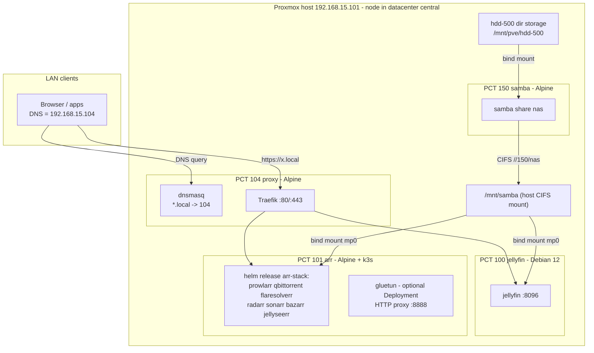

# Design — homelab-foundation

## Overview

Two-layer IaC: **OpenTofu** (bpg/proxmox provider) owns container lifecycle on
the Proxmox node; **Ansible** owns everything inside containers and the one
host-level concern (the CIFS mount). Existing containers are *imported*, never
recreated. A new proxy container (Traefik + dnsmasq) provides
`https://<service>.local` for the LAN.



## Inventory of managed resources

| PCT | Name     | OS        | IP (static)        | CPU | RAM/Swap MB | Rootfs (local-lvm) | Extra storage |
|-----|----------|-----------|--------------------|-----|-------------|--------------------|---------------|
| 100 | jellyfin | Debian 12 | 192.168.15.102/24  | 2   | 2048/512    | 8 GB               | bind: host `/mnt/samba` → `/mnt/samba` |
| 101 | arr      | Alpine    | 192.168.15.103/24  | 4   | 4096/512    | 12 GB (k3s + images) | bind: host `/mnt/samba` → `/mnt/samba`; `/dev/net/tun` passthrough |
| 150 | samba    | Alpine    | 192.168.15.150/24  | 4   | 2048/512    | 4 GB               | bind: host `/mnt/pve/hdd-500` → `/srv/nas` |
| 104 | proxy    | Alpine    | 192.168.15.104/24  | 1   | 512/512     | 2 GB               | none (deliberately NAS-independent) |

All unprivileged. Gateway `192.168.15.1`, bridge `vmbr0` (variables).
Sizes for 100/101/150 are assumptions — align variables with `pct config <id>`
before the first apply so the plan is a no-op on those attributes.

## Key decisions

1. **CIFS is mounted on the Proxmox host, bind-mounted into containers.**
   Unprivileged LXC cannot mount CIFS (no `CAP_SYS_ADMIN` in the user
   namespace). The existing fstab line (`uid=100000,gid=110000,...`) already
   implies this pattern: host uid 100000 = container root, host gid 110000 =
   container gid 10000. That is why every service runs with `PGID=10000` — group
   `10000` inside a container gets rw via `file_mode=0660,dir_mode=0770`.
   The jellyfin system user is therefore added to a group with gid 10000.

2. **`nobrl` added to the CIFS mount options.** Service configs (SQLite DBs for
   the arr apps and jellyfin) move onto the share per requirement 2.2. SQLite
   over CIFS fails on byte-range locks; `nobrl` disables them. Residual risk:
   SQLite-on-network-share is never as robust as local disk — accepted
   trade-off for centralized config, called out here deliberately.

3. **Proxy container does not depend on the NAS.** Traefik/dnsmasq config is
   fully declarative from this repo (Ansible templates), so storing it on samba
   adds a dependency cycle (DNS/proxy down when NAS is down) for zero benefit.
   Requirement 2.2 is interpreted as applying to *stateful* service config.

4. **Import-first workflow.** PCT 100/101/150 are imported
   (`tofu import ... <node>/<vmid>`). Their resources carry
   `lifecycle { prevent_destroy = true }` (a destructive plan errors out) and
   `ignore_changes = [operating_system]` (template lineage of an imported
   container is unknowable; without this the provider would force replacement).

5. **gluetun is an independent egress *service*, not a network wrapper.**
   Considered and rejected: (a) sharing gluetun's network namespace with
   qbittorrent (the compose `network_mode: service:gluetun` pattern / a k8s
   pod-level sidecar) — couples qbittorrent's entire network to gluetun's
   lifecycle, violating the hard constraint that qbittorrent never depends on
   gluetun; (b) routing the whole arr LXC through the VPN — same problem,
   amplified: *every* service including web UIs would break when the tunnel is
   down. Chosen design: gluetun is its own Deployment + LoadBalancer Service,
   rendered only when the Helm value `gluetun.enabled` is true, publishing an
   HTTP proxy on `:8888` (`HTTPPROXY=on`). Applications that want VPN egress
   opt in through their own proxy settings (qBittorrent → Settings →
   Connection → Proxy → `192.168.15.103:8888`); flipping that app setting is
   the only integration point. Every other workload's manifest is
   byte-identical whether gluetun is on or off. Note: if an app was pointed at
   the proxy and gluetun is later disabled, that app's own proxy setting must
   be unset — inherent to app-level opt-in, documented in the runbook.
   Credentials flow Vault → Ansible-rendered values file (0600 on PCT 101) →
   k8s Secret (`envFrom`). It needs `NET_ADMIN` + `/dev/net/tun` (hostPath);
   OpenTofu passes `/dev/net/tun` into PCT 101 unconditionally (harmless while
   unused; PVE 8 `dev0` passthrough works for unprivileged containers).

6. **`.local` as requested, with eyes open.** `.local` collides with
   mDNS/Bonjour (RFC 6762); some clients (Apple, some Linux resolvers) may
   bypass unicast DNS for it. Accepted per PLAN.md; if it bites, switch the
   dnsmasq/Traefik domain variable to `.lan` or `.home.arpa` — it is a single
   variable change.

7. **Self-signed TLS.** Traefik serves its default cert; browsers warn once.
   A local CA (mkcert/step-ca) is a future spec.

8. **arr runs on k3s inside the unprivileged LXC; deployed by a repo-local
   Helm chart.** k3s (single node, server mode) is the smallest practical k8s.
   Unprivileged-LXC accommodations, all encoded in the `k3s` role:
   `nesting=1,keyctl=1` (already set for the container), a `/dev/kmsg` shim
   (`/etc/local.d`, symlink to `/dev/console` — kubelet insists on it),
   `kubelet-arg: feature-gates=KubeletInUserNamespace=true` (tolerates missing
   cgroup/kernel access in a user namespace), and
   `kube-proxy-arg: conntrack-max-per-core=0` (sysctls are read-only in the
   userns). Bundled traefik and metrics-server are disabled — ingress lives in
   the proxy CT and RAM is scarce. k3s + helm come from Alpine's community
   repo (no curl-pipe installers). Services are exposed on the node IP at the
   legacy ports via k3s servicelb (LoadBalancer), so the proxy CT and LAN
   clients see no difference from the compose era. The chart is local to this
   repo (`kubernetes/charts/arr-stack`) — no third-party chart dependency, one
   `values.yaml` as the single source of app wiring. Known risks, accepted:
   k3s in an unprivileged LXC is the least-trodden path in this design (if
   overlayfs snapshotter misbehaves, set `snapshotter: native` in
   `/etc/rancher/k3s/config.yaml`), and k3s server overhead (~700 MB) eats into
   the container's 4 GB — bump `arr_memory` to 6144 if pods get evicted.

9. **Bind mounts require root API access.** Proxmox only allows `mp` host-path
   entries for root@pam. The tofu provider must authenticate with a root@pam
   API token (documented in tfvars example).

## Components

### OpenTofu (`tofu/`)

- `versions.tf`, `providers.tf` — bpg/proxmox ~> 0.66, endpoint + token vars.
- `templates.tf` — `proxmox_virtual_environment_download_file` for Alpine and
  Debian 12 official templates (URLs are variables; verify current filenames
  with `pveam available`).
- `jellyfin.tf`, `arr.tf`, `samba.tf`, `proxy.tf` — one container each, as per
  the inventory table.
- `variables.tf` / `terraform.tfvars.example` — all tunables; token is
  sensitive, no default.
- `outputs.tf` — name → IP map.

### Ansible (`ansible/`)

Roles:

| Role           | Target   | Responsibility |
|----------------|----------|----------------|
| `samba_server` | PCT 150  | samba pkg, `smb.conf` ([nas] share, SMB3, sambauser), share tree (`media/*`, `configs/*`), passdb user from Vault |
| `jellyfin`     | PCT 100  | official apt repo, package, gid-10000 group membership, systemd override pointing config/data at `/mnt/samba/configs/jellyfin/` (cache/logs local) |
| `k3s`          | PCT 101  | apk k3s + helm, `/dev/kmsg` shim, `/etc/rancher/k3s/config.yaml` (disable traefik/metrics-server, userns kubelet/kube-proxy args), service up |
| `arr_stack`    | PCT 101  | copies `kubernetes/charts/arr-stack` to the CT, renders values (configs on share, `gluetun.enabled`, Vault creds), `helm upgrade --install` |
| `proxy`        | PCT 104  | dnsmasq (`address=/local/104`, upstream forwarders), Traefik binary + OpenRC service, static config (web→websecure redirect, file provider), dynamic routers/services rendered from `proxy_services` list |

Playbooks:

- `bootstrap.yml` — runs on the PVE host; `pct exec` installs python3 + sshd +
  the operator's pubkey in each container (Alpine templates ship without sshd).
- `storage.yml` — samba_server role, then PVE host: `cifs-utils`, credentials
  file (0600, from Vault), fstab + mount `/mnt/samba`; restarts consumer
  containers when the mount first appears (they bind-mounted an empty dir).
- `services.yml` — jellyfin, k3s+arr_stack, proxy roles.
- `site.yml` — imports storage.yml then services.yml.
- `migrate-configs.yml` — one-time copy of legacy configs to the share
  (stop service → copy iff destination empty → start; never deletes sources).

### Traefik routing table (rendered from `proxy_services` var)

| Host                 | Backend                       |
|----------------------|-------------------------------|
| jellyfin.local       | http://192.168.15.102:8096    |
| prowlarr.local       | http://192.168.15.103:9696    |
| qbittorrent.local    | http://192.168.15.103:8080    |
| radarr.local         | http://192.168.15.103:7878    |
| sonarr.local         | http://192.168.15.103:8989    |
| bazarr.local         | http://192.168.15.103:6767    |
| jellyseerr.local     | http://192.168.15.103:5055    |
| flaresolverr.local   | http://192.168.15.103:8191    |
| proxmox.local        | https://192.168.15.101:8006 (insecure backend transport) |
| traefik.local        | api@internal (dashboard)      |

### Share layout (`//192.168.15.150/nas`)

```
media/{downloads,movies,shows,test_movies,test_shows}
configs/
  jellyfin/{config,data}
  arr/{prowlarr,qbittorrent,radarr,sonarr,bazarr,jellyseerr}
```

## Error handling & safety

- `prevent_destroy` on PCT 100/101/150; plan fails rather than recreates.
- Rootfs shrink is impossible on LXC → provider errors; fix by aligning the
  size variable with reality, never by recreating.
- Migration playbook is guarded: copies only when destination is empty,
  never deletes sources (requirement 7). Rollback = point config paths back
  at the untouched originals.
- Host CIFS mount uses `nofail,_netdev` so the PVE host boots when the NAS
  container is down.
- gluetun down/disabled affects nothing else by construction (own Deployment,
  no coupling); only an app explicitly pointed at the proxy loses egress.
- Ordering: samba must be configured (storage.yml) before jellyfin/arr configs
  on the share are usable; and the legacy compose stack must be stopped
  (migrate-configs.yml) before k3s servicelb can bind the same ports — the
  runbook in tasks.md encodes the order.
- k3s data (`/var/lib/rancher`) stays on the rootfs by design — it is cattle;
  everything worth keeping is in the hostPath config dirs on the share.

## Testing strategy

- **Static:** `tofu fmt -check`, `tofu validate`; `ansible-lint` /
  `ansible-playbook --syntax-check` for every playbook; `helm lint` +
  `helm template` for the chart (both gluetun.enabled states).
- **Plan review:** after import, `tofu plan` against 100/101/150 must show no
  destroy/replace actions — that is the import acceptance gate.
- **Ansible dry-run:** `--check --diff` against live hosts before first real run.
- **Smoke tests (post-apply):**
  - `dig +short jellyfin.local @192.168.15.104` → `192.168.15.104`
  - `curl -kIs https://jellyfin.local --resolve jellyfin.local:443:192.168.15.104` → 200/302
  - `smbclient -L //192.168.15.150 -U sambauser` lists `nas`
  - `kubectl get pods -n arr` all Running; `kubectl get svc -n arr` shows
    LoadBalancer external IP 192.168.15.103 on the legacy ports; each web UI
    answers.
  - gluetun (when enabled): `curl -x http://192.168.15.103:8888 https://ifconfig.me`
    returns the VPN exit IP, while `curl https://ifconfig.me` from qbittorrent
    still returns the WAN IP unless its in-app proxy is set.
