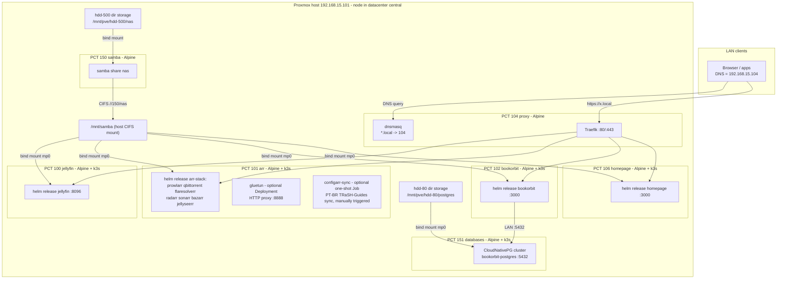

# Design — homelab-foundation

## Overview

This spec uses a two-layer IaC approach: **OpenTofu** (bpg/proxmox provider) manages the lifecycle of seven unprivileged LXC containers on a single Proxmox VE node, while **Ansible** handles all in-container configuration including k3s, Helm charts, Samba, dnsmasq, and Traefik. Persistent service config lives on a central Samba NAS container (PCT 150) that is bind-mounted into each consumer container over CIFS, with the sole exceptions of the proxy container (PCT 104, stateless) and the databases container (PCT 151, whose Postgres data is backed directly by the hdd-80 Proxmox bind mount to avoid network-filesystem locking risks.

## Architecture

Two-layer IaC: **OpenTofu** (bpg/proxmox provider) owns container lifecycle on
the Proxmox node; **Ansible** owns everything inside containers and the one
host-level concern (the CIFS mount). The existing containers (100, 101, 150)
are being deleted and recreated from this spec rather than imported — the
only thing that must survive the rebuild is the hdd-500 NAS data (see Key
decision 4). A new proxy container (Traefik + dnsmasq) provides
`https://<service>.local` for the LAN.



## Inventory of managed resources

| PCT | Name     | OS        | IP (static)        | CPU | RAM/Swap MB | Rootfs (local-lvm) | Extra storage |
|-----|----------|-----------|--------------------|-----|-------------|--------------------|---------------|
| 100 | jellyfin | Alpine + k3s | 192.168.15.102/24  | 2   | 4096/512    | 16 GB              | bind: host `/mnt/samba` → `/mnt/samba`; iGPU passthrough (`/dev/dri/renderD128`, `/dev/dri/card1`) for QSV transcode |
| 101 | arr      | Alpine    | 192.168.15.103/24  | 4   | 6144/512    | 12 GB (k3s + images) | bind: host `/mnt/samba` → `/mnt/samba`; `/dev/net/tun` passthrough |
| 150 | samba    | Alpine    | 192.168.15.150/24  | 4   | 2048/512    | 4 GB               | bind: host `/mnt/pve/hdd-500/nas` → `/srv/nas` |
| 104 | proxy    | Alpine    | 192.168.15.104/24  | 1   | 512/512     | 2 GB               | none (deliberately NAS-independent) |
| 102 | bookorbit | Alpine + k3s | 192.168.15.105/24 | 2 | 2560/512  | 10 GB              | bind: host `/mnt/samba` → `/mnt/samba` |
| 151 | databases | Alpine + k3s | 192.168.15.151/24 | 2 | 2048/512  | 8 GB               | bind: host `/mnt/pve/hdd-80/postgres` → `/srv/data` |
| 106 | homepage  | Alpine + k3s | 192.168.15.106/24 | 1 | 1024/512  | 8 GB               | bind: host `/mnt/samba` → `/mnt/samba` |

All unprivileged. Gateway `192.168.15.1`, bridge `vmbr0` (variables). These
sizes are the target for the from-scratch rebuild (containers 100/101/150
are deleted and recreated, not imported) — they don't need to match whatever
footprint the old containers happened to grow into.

## Key decisions

1. **CIFS is mounted on the Proxmox host, bind-mounted into containers.**
   Unprivileged LXC cannot mount CIFS (no `CAP_SYS_ADMIN` in the user
   namespace). The existing fstab line (`uid=100000,gid=110000,...`) already
   implies this pattern: host uid 100000 = container root, host gid 110000 =
   container gid 10000. That is why every service runs with `PGID=10000` — group
   `10000` inside a container gets rw via `file_mode=0660,dir_mode=0770`.
   The jellyfin system user is therefore added to a group with gid 10000.

2. **`nobrl` added to the CIFS mount options.** Service configs (SQLite DBs for
   the arr apps and jellyfin) move onto the share per requirement 2.2. SQLite
   over CIFS fails on byte-range locks; `nobrl` disables them. Residual risk:
   SQLite-on-network-share is never as robust as local disk — accepted
   trade-off for centralized config, called out here deliberately.

3. **Proxy container does not depend on the NAS.** Traefik/dnsmasq config is
   fully declarative from this repo (Ansible templates), so storing it on samba
   adds a dependency cycle (DNS/proxy down when NAS is down) for zero benefit.
   Requirement 2.2 is interpreted as applying to *stateful* service config.

4. **Delete-and-recreate, not import.** PCT 100/101/150 predate this repo and
   drifted from it (ad-hoc resizing, a community-script install on 100, an
   undocumented GPU passthrough hand-added to 101 that nothing consumes).
   Rather than reconciling tofu to match that drift, the containers are
   deleted and recreated fresh via `tofu apply` so they exactly match this
   spec. `lifecycle { prevent_destroy = true }` guards them once created (a
   destructive plan errors out); there's no `ignore_changes` on
   `operating_system` because a freshly created container's OS genuinely
   matches what's declared — no imported-template ambiguity to ignore.
   **Data safety is the one hard constraint on the delete step**: hdd-500
   currently backs PCT 150's rootfs disk directly (`pct config 150` shows
   `rootfs: hdd-500:150/vm-150-disk-0.raw,size=458G`, no separate mount) —
   simply destroying that container would destroy the NAS payload with it.
   Before deleting PCT 150, the real directory tree must be copied out of
   that raw disk image onto `/mnt/pve/hdd-500/nas` — a *subdirectory* of
   hdd-500, not its bare root, so PVE's own `images/`/`template/`/`dump/`
   folders on that storage don't end up inside the samba share (`pct mount
   150` + `rsync`, full runbook in tasks.md 4.3 — including a preflight
   space check, since the copy temporarily needs ~2x the data size free on
   hdd-500 until the old disk is deleted). The freshly recreated PCT 150 —
   built per Requirement 2.1, with a small local-lvm rootfs and
   `hdd500_host_path` (`/mnt/pve/hdd-500/nas`) bind-mounted at `/srv/nas` —
   then reattaches to already-populated data instead of an empty share.
   PCT 100 and 101 are *not* data-free either: jellyfin's
   `/etc/jellyfin` + `/var/lib/jellyfin` (library metadata, watch history,
   users) and arr's legacy `/srv/<service>/config` dirs are still local to
   those containers today, not yet on the samba share. `migrate-configs.yml`
   already does exactly this copy (stop service → rsync to
   `configs_root` → leave source untouched) — it must be run against the
   *existing* PCT 100/101 before they're deleted, not after the rebuild. Once
   migrated, the fresh containers (with `/mnt/samba` bind-mounted from the
   start) find their config already on the share and never fresh-initialize
   into an empty state. Order: `migrate-configs.yml` against old 100/101 →
   extract hdd-500's data out of 150's disk image → delete 100/101/150 →
   `tofu apply` → `bootstrap.yml`/`storage.yml`/`site.yml` against the new
   containers.

5. **gluetun is an independent egress *service*, not a network wrapper.**
   Considered and rejected: (a) sharing gluetun's network namespace with
   qbittorrent (the compose `network_mode: service:gluetun` pattern / a k8s
   pod-level sidecar) — couples qbittorrent's entire network to gluetun's
   lifecycle, violating the hard constraint that qbittorrent never depends on
   gluetun; (b) routing the whole arr LXC through the VPN — same problem,
   amplified: *every* service including web UIs would break when the tunnel is
   down. Chosen design: gluetun is its own Deployment + LoadBalancer Service,
   rendered only when the Helm value `gluetun.enabled` is true, publishing an
   HTTP proxy on `:8888` (`HTTPPROXY=on`). Applications that want VPN egress
   opt in through their own proxy settings (qBittorrent → Settings →
   Connection → Proxy → `192.168.15.103:8888`); flipping that app setting is
   the only integration point. Every other workload's manifest is
   byte-identical whether gluetun is on or off. Note: if an app was pointed at
   the proxy and gluetun is later disabled, that app's own proxy setting must
   be unset — inherent to app-level opt-in, documented in the runbook.
   Credentials flow Vault → Ansible-rendered values file (0600 on PCT 101) →
   k8s Secret (`envFrom`). It needs `NET_ADMIN` + `/dev/net/tun` (hostPath);
   OpenTofu passes `/dev/net/tun` into PCT 101 unconditionally (harmless while
   unused; PVE 8 `dev0` passthrough works for unprivileged containers).

6. **`.local` as requested, with eyes open.** `.local` collides with
   mDNS/Bonjour (RFC 6762); some clients (Apple, some Linux resolvers) may
   bypass unicast DNS for it. Accepted per PLAN.md; if it bites, switch the
   dnsmasq/Traefik domain variable to `.lan` or `.home.arpa` — it is a single
   variable change.

7. **Self-signed TLS.** Traefik serves its default cert; browsers warn once.
   A local CA (mkcert/step-ca) is a future spec.

8. **arr runs on k3s inside the unprivileged LXC; deployed by a repo-local
   Helm chart.** k3s (single node, server mode) is the smallest practical k8s.
   Unprivileged-LXC accommodations, all encoded in the `k3s` role:
   `nesting=1` (keyctl turned out unneeded for k3s/containerd — dropped after
   `pct config 101` showed the live container never actually had it set), a
   `/dev/kmsg` shim
   (`/etc/local.d`, symlink to `/dev/console` — kubelet insists on it),
   `kubelet-arg: feature-gates=KubeletInUserNamespace=true` (tolerates missing
   cgroup/kernel access in a user namespace),
   `kube-proxy-arg: conntrack-max-per-core=0` (sysctls are read-only in the
   userns), and a `cgroup-delegate` OpenRC service (`/etc/init.d`, `before
   k3s` in its `depend()`) — Alpine has no systemd to delegate cgroup v2
   controllers to child cgroups on boot the way it would on a systemd host,
   so without this kubelet's `ContainerManager` fails to create its
   `kubepods` cgroup (`cgroup ["kubepods"] has some missing controllers`) and
   k3s crash-loops every ~5s indefinitely (found by diagnosing PCT 100 doing
   exactly that: `wait_for: port 6443` passed once, then `helm upgrade
   --install` hit connection-refused because the API server had already died
   again). The service does two things, in order: migrates every process
   already in the root cgroup into a leaf (`/sys/fs/cgroup/init`) — cgroup v2
   refuses to enable controllers in a cgroup's `subtree_control` while it
   still holds member processes directly, and nothing else ever moves them
   out on Alpine — then writes `+cpuset +cpu +hugetlb +memory +pids` into
   the now-empty root's `subtree_control` so kubelet can create `kubepods`
   under it. Bundled traefik and metrics-server are
   disabled — ingress lives in
   the proxy CT and RAM is scarce. k3s + helm come from Alpine's community
   repo (no curl-pipe installers). Services are exposed on the node IP at the
   legacy ports via k3s servicelb (LoadBalancer), so the proxy CT and LAN
   clients see no difference from the compose era. The chart is local to this
   repo (`kubernetes/charts/arr-stack`) — no third-party chart dependency, one
   `values.yaml` as the single source of app wiring. Known risks, accepted:
   k3s in an unprivileged LXC is the least-trodden path in this design (if
   overlayfs snapshotter misbehaves, set `snapshotter: native` in
   `/etc/rancher/k3s/config.yaml`). k3s server overhead (~700 MB) plus seven
   app pods was tight against the original 4 GB default — `arr_memory`
   defaults to 6144 now. `tzdata` is installed alongside `k3s`/`helm`:
   Alpine doesn't ship IANA zoneinfo by default, and k3s's Go runtime reads
   `/usr/share/zoneinfo` to resolve IANA zone names used anywhere in the
   cluster.

9. **Bind mounts require a root@pam ticket, not an API token.** Proxmox only
   allows `mp` host-path entries for root@pam. Its permission check compares
   authuser literally against `root@pam`; an API token's authuser is
   `root@pam!<tokenid>`, which never matches — token auth 403s on every
   container with a bind mount (arr, jellyfin, samba). The tofu provider
   authenticates with `username`/`password` (ticket auth) instead
   (documented in tfvars example).

10. **Jellyfin runs on Alpine via k3s + Helm, not Debian via apt.**
    Originally PCT 100 was declared as a Debian 12 container so jellyfin
    could install from `repo.jellyfin.org`'s Debian/Ubuntu apt repo — the
    one distro family Jellyfin ships a first-party native package for.
    Switched to Alpine (matching every other container in the fleet) for a
    simpler, uniform template story. Alpine does have its own
    `jellyfin`/`jellyfin-openrc` apk packages, but they live in the `edge`
    branch of Alpine's community repo — not in the stable release this
    fleet's template pins (unlike `k3s`/`helm`, which are in the stable
    community repo already). Mixing an edge package onto a stable base is
    the kind of fragile pinning this repo avoids elsewhere.
    Two container-runtime paths were considered for running the official
    `jellyfin/jellyfin` image: plain Docker (Jellyfin's own documented route
    for anything outside Debian/Ubuntu, and what this repo's legacy compose
    era already proved out), or k3s + a repo-local Helm chart, mirroring the
    arr stack. Went with **k3s + Helm** — operator's explicit call, for
    consistency with arr's existing pattern (one deployment model across the
    fleet, one `helm upgrade --install` mental model, one `k3s` role reused
    unmodified on both containers) — even though it costs a second ~700 MB
    k3s control plane (design decision 8) that a single app wouldn't
    otherwise need. `nesting=1` is set (no `keyctl` — that's Docker-specific,
    not needed for k3s/containerd, same finding as arr). GPU access: PVE
    `device_passthrough` puts the iGPU render nodes in the LXC with
    `mode = "0666"` (world-rw — sidesteps needing to know the pod's
    render/video gid up front, which isn't guaranteed to match what the old
    Debian box happened to have); the chart hostPath-mounts them
    (`type: CharDevice`) into the jellyfin pod. Config/data volumes are
    hostPath-mounted from the samba share (requirement 5.2); cache is an
    `emptyDir` (node-local, not the share) so transcode scratch I/O isn't
    fighting CIFS latency. PCT 100 and PCT 101 each run their *own*
    single-node k3s — no cross-node clustering, consistent with the
    single-node-per-stack Non-Goal.

11. **Configarr syncs PT-BR TRaSH-Guides quality profiles into sonarr/radarr
    as a one-shot Job, triggered on demand.** Mirrors gluetun's independence
    pattern: own objects gated by `configarr.enabled`, nothing else
    references it.
    - **Job named `configarr-sync-{{ .Values.configarr.syncTrigger }}`.**
      `configarr.syncTrigger` (Ansible: `configarr_sync_trigger`, a plain
      inventory var) is part of the Job's name. The first time
      `configarr.enabled` goes true, `configarr-sync-1` is a name Helm
      creates fresh as part of that `helm upgrade --install`, which is what
      seeds the profiles on first rollout. A resync happens by bumping the
      trigger to a new value and re-applying, giving Helm a new object name
      to create; an unchanged trigger keeps the existing Job as-is across
      routine `helm upgrade --install` runs. `backoffLimit: 2` bounds
      retries against sonarr/radarr's API, and `ttlSecondsAfterFinished:
      86400` cleans up completed Job objects from past triggers.
    - **Config vendored under `kubernetes/charts/arr-stack/files/configarr/`.**
      `scripts/update-configarr.sh` clones `trash-guides-ptbr` and merges
      `config-DUBLADO-SEM-ANIMES.yaml` + `config-LEGENDADO-SEM-ANIMES.yaml`
      into one `config.yml`, loaded at render time via Helm's
      `.Files.Get`/`.Files.Glob` into two ConfigMaps alongside the
      `custom-formats/*.json` files — consistent with the arr-stack chart's
      one-`values.yaml`-source-of-truth posture.
    - **DUBLADO and LEGENDADO merged into `HD (Dublado)` and
      `HD (Legendado)` as two coexisting quality profiles.**
      `update-configarr.sh` renames each source variant's `HD` profile (and
      every `custom_formats[].assign_scores_to[]` reference to it) before
      concatenating their `custom_formats`/`quality_profiles` arrays,
      Dublado first, so both profiles land in sonarr/radarr side by side.
      SEM-ANIMES matches the fleet's single sonarr/radarr instance
      (Non-Goals).

12. **Postgres/pgvector (BookOrbit) doesn't fit the CIFS-config-on-share
    pattern, so it gets its own hdd-80-backed container instead.** Every
    other service's config lives on the samba share (Key decision 2), with
    `nobrl` accepted as a tolerable trade-off for SQLite specifically.
    Postgres is far less tolerant of network-filesystem locking semantics
    than SQLite — running its data directory over CIFS risks real
    corruption, not just a performance hit. It's also moot for this fleet:
    **pgvector has no Alpine package**, checked on both `v3.21` (stable)
    and `edge` — zero results either way — so a native `apk add
    postgresql` + pgvector anywhere in this fleet isn't possible without
    compiling from source. Resolution: a new `databases` container (PCT
    151) runs Postgres via CloudNativePG (Key decision 13), with data
    backed by the previously-unassigned `hdd-80` disk, bind-mounted
    directly into the container exactly like `hdd-500` is bind-mounted
    into samba (PCT 150) — a plain Proxmox directory-storage bind, not a
    network filesystem, so none of the CIFS locking risk applies.
    BookOrbit's own container (PCT 102) reaches it purely over the LAN
    (`192.168.15.151:5432`), the same way it would reach any external
    database per BookOrbit's own docs. `databases` is vmid 151 — the
    operator's convention reserves `150+` for shared/infrastructure
    containers (samba is 150) versus `100+` for per-app containers.

13. **CloudNativePG, pinned to v1.29.2, not the latest release.** This
    fleet's k3s (Alpine `v3.21`'s `k3s` package, 1.31.3) is older than what
    CloudNativePG's currently-supported releases target — 1.30.x requires
    Kubernetes 1.34+, and even 1.29.x lists 1.31 only as "tested, not
    supported" (1.33+ is its supported floor). v1.29.2 is the newest
    release that still tests against 1.31, so it's the one installed
    (`kubectl apply --server-side -f
    .../release-1.29/releases/cnpg-1.29.2.yaml`) rather than latest.
    CloudNativePG is installed as an operator (CRDs + controller in the
    `cnpg-system` namespace), not a Helm chart — the actual Postgres
    instance is a `Cluster` custom resource, not a `helm upgrade
    --install` release, unlike every other workload in this fleet. The
    `Cluster` uses `imageName:
    ghcr.io/cloudnative-pg/postgresql:17.6-standard-trixie` — CloudNativePG's
    own "standard" operand image, which bundles pgvector (and PGAudit,
    JIT) — no custom image build needed. Storage is a
    statically-provisioned `PersistentVolume` (hostPath into the hdd-80
    bind mount, `storageClassName: manual`) since no dynamic provisioner
    exists anywhere in this fleet; `bootstrap.initdb` creates the
    `bookorbit` database/owner directly from a Vault-sourced Secret, and
    `postInitApplicationSQL` runs `CREATE EXTENSION IF NOT EXISTS vector;`
    on first bootstrap. A hand-written `LoadBalancer` Service (selecting
    CloudNativePG's own primary-instance pod labels,
    `cnpg.io/cluster`/`cnpg.io/instanceRole`) exposes the cluster on PCT
    151's node IP for BookOrbit's separate k3s cluster to reach — CNPG's
    own auto-created Service is ClusterIP (ordinary Postgres client, not a
    web UI, so `Requirement 6`'s Traefik routing doesn't apply here).

14. **`vault_api_keys` — Homepage's read-only API key dict.** A single Vault
    dict (`sonarr_api_key`, `radarr_api_key`, `prowlarr_api_key`,
    `jellyfin_api_key`, `jellyseerr_api_key`, `bazarr_api_key`) that the
    `homepage` role reads from for widget credentials, via its own rendered
    values file and Kubernetes Secret. Named generically (not
    `vault_homepage_environment`) so other services that later need
    read-only API access to the same backends could adopt it too — Configarr
    keeps its own separate `vault_configarr_environment` for now, since
    migrating an already-deployed service's secret source isn't part of this
    change. `vault_qbittorrent_credentials` is a separate dict (`username`,
    `password`) for the qBittorrent web UI — kept separate because it's a
    login credential, not an API token, and may be rotated independently.
    `vault_gluetun_environment`, `vault_bookorbit_environment`, and
    `vault_configarr_environment` remain unchanged. `vault.yml.example`
    documents all five dicts.

15. **Homepage runs on k3s + Helm inside an unprivileged LXC (PCT 106),
    mirroring the jellyfin/bookorbit pattern.** Homepage is a stateless
    Node.js app whose only persistent state is its config directory (YAML
    files under `/app/config` inside the container, hostPath-mounted from the
    samba share at `/mnt/samba/configs/homepage/`). k3s overhead (~700 MB) is
    the same as every other single-service container in the fleet; no
    architectural reason to diverge from the established deployment model.
    Port 3000 is Homepage's default; Traefik routes `homepage.local` to it.
    NAS-independence is not required here — Homepage's config *is* its value
    (bookmarks, widget config) and lives on the share by design.

## Components and Interfaces

### OpenTofu (`tofu/`)

- `versions.tf`, `providers.tf` — bpg/proxmox ~> 0.66, endpoint + token vars.
- `templates.tf` — `proxmox_virtual_environment_download_file` for the Alpine
  official template (URL is a variable; verify current filename with
  `pveam available`). Every container in the fleet is Alpine.
- `jellyfin.tf`, `arr.tf`, `samba.tf`, `proxy.tf`, `bookorbit.tf`, `databases.tf`, `homepage.tf` — one container each, as per
  the inventory table.
- `variables.tf` / `terraform.tfvars.example` — all tunables; token is
  sensitive, no default.
- `outputs.tf` — name → IP map.

### Ansible (`ansible/`)

Roles:

| Role           | Target   | Responsibility |
|----------------|----------|----------------|
| `samba_server` | PCT 150  | samba pkg, `smb.conf` ([nas] share, SMB3, sambauser), share tree (`media/*`, `configs/*`), passdb user from Vault |
| `k3s`          | PCT 100, PCT 101 | apk k3s + helm, `/dev/kmsg` shim, `/etc/rancher/k3s/config.yaml` (disable traefik/metrics-server, userns kubelet/kube-proxy args), service up — reused unmodified on both, two independent single-node clusters |
| `jellyfin`     | PCT 100  | copies `kubernetes/charts/jellyfin` to the CT, renders values (paths on share), `helm upgrade --install` |
| `arr_stack`    | PCT 101  | copies `kubernetes/charts/arr-stack` to the CT, renders values (configs on share, `gluetun.enabled`, `configarr.enabled`, Vault creds), `helm upgrade --install` |
| `bookorbit`    | PCT 102  | copies `kubernetes/charts/bookorbit` to the CT, renders values (paths on share, database host, Vault creds), `helm upgrade --install` |
| `databases`    | PCT 151  | `kubectl apply`s the CloudNativePG operator manifest, a static hdd-80-backed `PersistentVolume`, and the `bookorbit-postgres` `Cluster`/Secret/Service — no Helm involved |
| `proxy`        | PCT 104  | dnsmasq (`address=/local/104`, upstream forwarders), Traefik binary + OpenRC service, static config (web→websecure redirect, file provider), dynamic routers/services rendered from `proxy_services` list |
| `homepage`     | PCT 106  | copies `kubernetes/charts/homepage` to the CT, renders values (`homepage_services`, `vault_api_keys`, `vault_qbittorrent_credentials`), `helm upgrade --install` |

Playbooks:

- `bootstrap.yml` — runs on the PVE host; `pct exec` installs python3 + sshd +
  the operator's pubkey in each container (Alpine templates ship without sshd).
- `storage.yml` — samba_server role, then PVE host: `cifs-utils`, credentials
  file (0600, from Vault), fstab + mount `/mnt/samba`; restarts consumer
  containers when the mount first appears (they bind-mounted an empty dir).
- `services.yml` — jellyfin, k3s+arr_stack, proxy, bookorbit, databases, homepage roles.
- `site.yml` — imports storage.yml then services.yml.
- `migrate-configs.yml` — one-time copy of legacy configs to the share
  (stop service → copy iff destination empty → start; never deletes sources).
- `recover-hdd80-mount.yml` — re-locates hdd-80 by filesystem UUID after a
  disconnect/reconnect and reboots the databases container, mirroring
  `recover-nas-mount.yml`'s pattern for hdd-500 (shorter cascade — no CIFS
  layer between hdd-80 and its one consumer).

### Traefik routing table (rendered from `proxy_services` var)

| Host                 | Backend                       |
|----------------------|-------------------------------|
| jellyfin.local       | http://192.168.15.102:8096    |
| bookorbit.local      | http://192.168.15.105:3000    |
| homepage.local       | http://192.168.15.106:3000    |
| prowlarr.local       | http://192.168.15.103:9696    |
| qbittorrent.local    | http://192.168.15.103:8080    |
| radarr.local         | http://192.168.15.103:7878    |
| sonarr.local         | http://192.168.15.103:8989    |
| bazarr.local         | http://192.168.15.103:6767    |
| jellyseerr.local     | http://192.168.15.103:5055    |
| flaresolverr.local   | http://192.168.15.103:8191    |
| proxmox.local        | https://192.168.15.101:8006 (insecure backend transport) |
| traefik.local        | api@internal (dashboard)      |

### Share layout (`//192.168.15.150/nas`)

```
media/{downloads,movies,shows,test_movies,test_shows}
media/books/{Ebooks,Audiobooks,Comics}
configs/
  jellyfin/{config,data}
  bookorbit/
  homepage/
  arr/{prowlarr,qbittorrent,radarr,sonarr,bazarr,jellyseerr,configarr}
```

Postgres's own data (hdd-80-backed, PCT 151) is **not** part of this share
— see Key decision 12.

## Data Models

### `proxy_services` list entry

Each entry in the `proxy_services` Ansible variable drives one Traefik router + service pair rendered by the `proxy` role.

```yaml
- name: string           # subdomain label, e.g. "jellyfin" → jellyfin.local
  url: string             # full URL of the upstream, e.g. "http://192.168.15.102:8096"
  insecure_backend: bool  # optional; true for HTTPS upstreams with self-signed certs (proxmox.local)
```

### `homepage_services` list entry

Consumed by the `homepage` role to render Homepage's `services.yaml`.

```yaml
- name: string        # display name shown in the dashboard
  url: string          # full HTTPS URL visible to the browser, e.g. "https://jellyfin.local"
  icon: string          # icon slug resolved by Homepage's icon pack, e.g. "jellyfin"
  widget:                # optional; activates a live-data widget
    type: string          # Homepage widget type, e.g. "jellyfin", "qbittorrent", "sonarr"
    url: string             # internal backend URL the server-side widget calls
    key_ref: string          # names a vault_api_keys entry; the chart's ConfigMap turns this
                              # into a {{HOMEPAGE_VAR_<key_ref>}} placeholder — the actual
                              # secret only ever reaches a Kubernetes Secret (Requirement
                              # 12.5), never this ConfigMap
    username_ref: string      # same indirection, for vault_qbittorrent_credentials.username
    password_ref: string      # same indirection, for vault_qbittorrent_credentials.password
```

### `vault_api_keys` dict

Vault dict for Homepage's widget credentials; named generically so other
services could adopt it later, though `arr_stack`/Configarr keeps its own
separate `vault_configarr_environment` for now.

```yaml
sonarr_api_key: string
radarr_api_key: string
prowlarr_api_key: string
jellyfin_api_key: string
jellyseerr_api_key: string
bazarr_api_key: string
```

### `vault_qbittorrent_credentials` dict

Login credentials for the qBittorrent web UI; kept separate from API keys because rotation cadence differs.

```yaml
username: string
password: string
```

### `vault_gluetun_environment` dict

Environment variables injected into the gluetun container via a Kubernetes Secret (`envFrom`). Exact keys depend on the VPN provider; typical shape:

```yaml
VPN_SERVICE_PROVIDER: string   # e.g. "mullvad"
VPN_TYPE: string               # e.g. "wireguard"
WIREGUARD_PRIVATE_KEY: string
WIREGUARD_ADDRESSES: string
SERVER_COUNTRIES: string
```

### `vault_bookorbit_environment` dict

Environment variables injected into the BookOrbit container. Scope is local to PCT 102.

```yaml
DATABASE_URL: string   # postgres connection string, e.g. "postgresql://bookorbit:<pw>@192.168.15.151:5432/bookorbit"
SECRET_KEY: string     # application secret
# …any additional BookOrbit env vars
```

### Helm values — `arr-stack` chart (key fields)

```yaml
gluetun:
  enabled: bool                # renders the gluetun Deployment + Service when true
  image: string                # container image, e.g. "ghcr.io/qdm12/gluetun:latest"

configarr:
  enabled: bool                # renders the configarr-sync Job when true
  syncTrigger: string|int      # part of the Job name; increment to force a resync

configs_root: string           # hostPath prefix on the node, e.g. "/mnt/samba/configs/arr"
media_root: string             # hostPath prefix for media, e.g. "/mnt/samba/media"
```

### Helm values — `homepage` chart (key fields)

```yaml
config_path: string            # hostPath on the node for /app/config, e.g. "/mnt/samba/configs/homepage"
allowedHosts: string           # HOMEPAGE_ALLOWED_HOSTS — Homepage 403s any other Host header
services: list                 # rendered by a ConfigMap into /app/config/services.yaml (mounted
                                # over config_path via subPath); shape matches homepage_services above
apiKeys: map                   # HOMEPAGE_VAR_-prefixed keys -> a Kubernetes Secret (envFrom)
qbittorrentCredentials: map    # username/password -> the same Secret, HOMEPAGE_VAR_-prefixed
```

### Helm values — `jellyfin` chart (key fields)

```yaml
config_path: string            # hostPath for /etc/jellyfin + /var/lib/jellyfin, e.g. "/mnt/samba/configs/jellyfin"
media_path: string             # hostPath for /mnt/samba/media
gpu:
  enabled: bool                # mounts /dev/dri/renderD128 and /dev/dri/card1 when true
```

### Helm values — `bookorbit` chart (key fields)

```yaml
config_path: string            # hostPath for app config on samba share
database_host: string          # hostname/IP of the databases container, e.g. "192.168.15.151"
database_port: int             # default 5432
```

---

## Correctness Properties

These invariants must hold at all times across the fleet. They are stated as named properties suitable for audit and property-based reasoning.

### Property 1: No plaintext secrets
**Validates: Requirements 8.1, 8.2**
No secret value (API key, password, VPN credential, database URL) appears in any file committed to the repository. All secrets flow exclusively through Vault → Ansible vars (in-memory) → rendered files with mode 0600 on the target host → Kubernetes Secrets. `vault.yml` is never committed; only `vault.yml.example` (with placeholder strings) is tracked.

### Property 2: Every container is unprivileged
**Validates: Requirements 1.2**
All LXC containers are created with `unprivileged = true` in OpenTofu. No container has `CAP_SYS_ADMIN` or any other elevated capability granted, with the sole exception of the explicitly declared device passthroughs (`/dev/dri/*` for PCT 100, `/dev/net/tun` for PCT 101).

### Property 3: CIFS mount uses `nobrl`
**Validates: Requirements 2.4**
The host fstab entry for `//192.168.15.150/nas` always includes the `nobrl` option. Any SQLite database stored on the share (arr configs, jellyfin library DB) depends on this to avoid byte-range lock failures.

### Property 4: Config directories live on the samba share
**Validates: Requirements 2.2, 3.2, 4.3, 5.2, 12.3**
For every stateful service (jellyfin, arr stack, bookorbit, homepage), the config hostPath resolves to a subdirectory of `/mnt/samba/configs/`. The proxy container (PCT 104) and the databases container (PCT 151) are the only declared exceptions (Key decisions 3 and 12 respectively).

### Property 5: Postgres data never touches a network filesystem
**Validates: Requirements 11.1, 11.3**
The CloudNativePG `Cluster`'s PersistentVolume hostPath resolves to the hdd-80 Proxmox bind mount (`/srv/data` inside PCT 151), not to any path under `/mnt/samba`. The PV reclaim policy is `Retain`.

### Property 6: gluetun failure is isolated
**Validates: Requirements 4.4, 4.5, 4.6**
No workload's Kubernetes manifest contains a reference to the gluetun Service or pod. The only coupling point is an operator-configured in-app proxy setting inside qBittorrent. Disabling gluetun (`gluetun.enabled: false`) produces byte-identical manifests for every other workload.

### Property 7: Migration is non-destructive
**Validates: Requirements 7.1, 7.2, 7.3**
`migrate-configs.yml` only writes to a destination directory when it is empty, and never deletes the source. Running it more than once is idempotent and safe.

### Property 8: hdd-500 NAS data survives the PCT 150 rebuild
**Validates: Requirements 2.1**
The delete-and-recreate sequence for PCT 150 is only safe after the raw disk image has been fully extracted to `/mnt/pve/hdd-500/nas` and the copy verified. The runbook in tasks.md enforces this ordering; no automation step deletes PCT 150 before the extraction is confirmed.

### Property 9: Static IPs are stable
**Validates: Requirements 1.1, 6.1, 12.1**
Each container's IP is declared in both OpenTofu (`ipv4_address`) and Ansible inventory. No container relies on DHCP. The Traefik routing table and all inter-service references (`database_host`, widget URLs) use these stable addresses.

### Property 10: `prevent_destroy` guards containers after initial creation
**Validates: Requirements 1.3**
Once OpenTofu creates PCT 100, 101, 102, 104, 106, 150, and 151, their resource blocks carry `lifecycle { prevent_destroy = true }`. A subsequent `tofu plan` that would destroy any of them errors out before apply, requiring an explicit lifecycle override.

---

## Error Handling

- `prevent_destroy` on PCT 100/101/150 guards them once the rebuild is done;
  it does not block the deliberate, operator-driven delete that precedes it.
- Migration playbook is guarded: copies only when destination is empty,
  never deletes sources (requirement 7). Rollback = point config paths back
  at the untouched originals.
- hdd-500 extraction (PCT 150) is manual and must complete, and be verified,
  before that container is deleted — there is no rollback once the disk
  image backing it is gone.
- Host CIFS mount uses `nofail,_netdev` so the PVE host boots when the NAS
  container is down.
- hdd-80 (databases container) is a direct Proxmox bind mount, not CIFS —
  no network-filesystem failure mode to plan around; reconnects are handled
  by `recover-hdd80-mount.yml` (Key decision 12).
- The `postgres-data-pv` `PersistentVolume` uses `persistentVolumeReclaimPolicy:
  Retain` — deleting the `bookorbit-postgres` Cluster or its PVC never
  deletes the underlying hdd-80 data.
- gluetun down/disabled affects nothing else by construction (own Deployment,
  no coupling); only an app explicitly pointed at the proxy loses egress.
- configarr's own one-shot Job reads/writes only against sonarr/radarr's own
  API; a failed sync leaves quality profiles at their last-synced state.
  `backoffLimit: 2` bounds retries; `ttlSecondsAfterFinished` cleans up
  completed/failed Job objects automatically.
- Ordering: samba must be configured (storage.yml) before jellyfin/arr configs
  on the share are usable; and the legacy compose stack must be stopped
  (migrate-configs.yml) before k3s servicelb can bind the same ports — the
  runbook in tasks.md encodes the order.
- k3s data (`/var/lib/rancher`) stays on the rootfs by design — it is cattle;
  everything worth keeping is in the hostPath config dirs on the share.

## Testing strategy

- **Static:** `tofu fmt -check`, `tofu validate`; `ansible-lint` /
  `ansible-playbook --syntax-check` for every playbook; `helm lint` +
  `helm template` for all four charts (arr-stack: both `gluetun.enabled`
  and both `configarr.enabled` states; homepage, jellyfin, bookorbit);
  `kubectl apply --dry-run=client -f` the rendered CloudNativePG manifests
  (PV/Cluster/Service — no Helm chart to lint for the databases role).
- **Plan review:** `tofu plan` should show 100/101/150 being created fresh
  (expected, since the old containers are deleted first) with no unexpected
  diffs against this spec's declared config.
- **Ansible dry-run:** `--check --diff` against live hosts before first real run.
- **Smoke tests (post-apply):**
  - `dig +short jellyfin.local @192.168.15.104` → `192.168.15.104`
  - `curl -kIs https://jellyfin.local --resolve jellyfin.local:443:192.168.15.104` → 200/302
  - `smbclient -L //192.168.15.150 -U sambauser` lists `nas`
  - `kubectl get pods -n jellyfin` Running; `kubectl get svc -n jellyfin`
    shows LoadBalancer external IP 192.168.15.102:8096; hardware transcode
    picks up the iGPU (Dashboard → Playback in the jellyfin web UI).
  - `kubectl get pods -n arr` all Running; `kubectl get svc -n arr` shows
    LoadBalancer external IP 192.168.15.103 on the legacy ports; each web UI
    answers.
  - gluetun (when enabled): `curl -x http://192.168.15.103:8888 https://ifconfig.me`
    returns the VPN exit IP, while `curl https://ifconfig.me` from qbittorrent
    still returns the WAN IP unless its in-app proxy is set.
  - `kubectl get pods -n cnpg-system` and `-n databases` Running;
    `pg_isready -h 192.168.15.151 -p 5432` succeeds.
  - `kubectl get pods -n bookorbit` Running; `dig +short bookorbit.local
    @192.168.15.104` → `192.168.15.104`; `curl -kIs https://bookorbit.local`
    → 200/302.
  - `kubectl get pods -n homepage` Running; `dig +short homepage.local
    @192.168.15.104` → `192.168.15.104`; `curl -kIs https://homepage.local`
    → 200/302; service widgets display live data (Jellyfin now-playing,
    qBittorrent download stats, Sonarr/Radarr/BookOrbit library counts).
