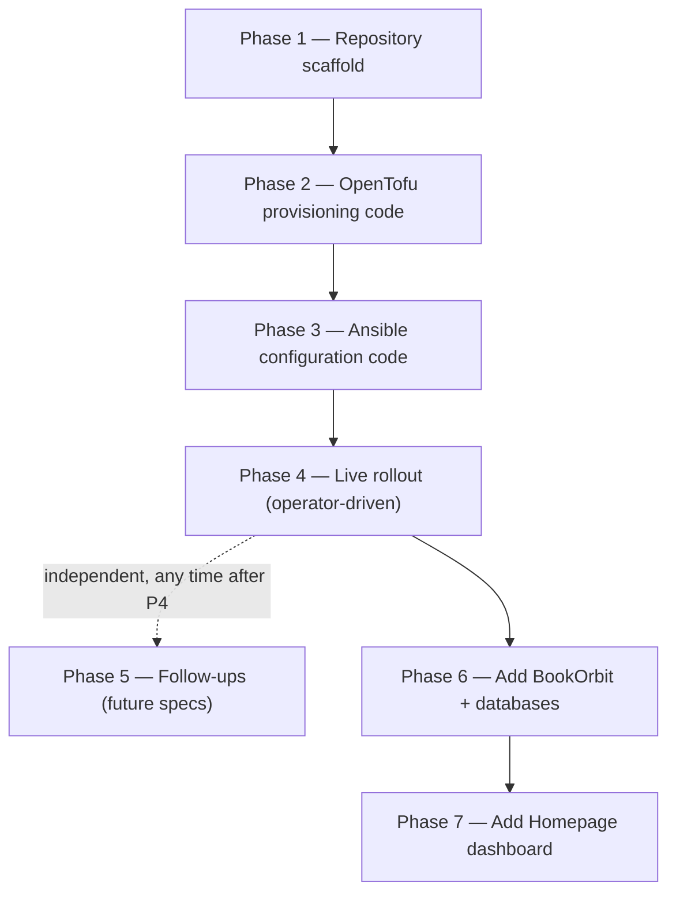

# Implementation Plan: homelab-foundation

## Overview

This spec provisions and configures a self-hosted homelab fleet on a single
Proxmox VE node using a two-layer IaC approach: **OpenTofu** manages LXC
container lifecycle (create, network, bind mounts, prevent_destroy), while
**Ansible** handles all in-container configuration (k3s, Helm charts, Samba,
dnsmasq, Traefik, and application roles).

The rollout is phased. Phases 1–3 are pure code authoring and can be done
offline. Phase 4 is the first live operation against the Proxmox node and
carries destructive steps (container delete + recreate) that require explicit
per-instance operator approval. Phases 6 and 7 extend the fleet with
additional containers (BookOrbit, databases, Homepage dashboard) and follow
the same code-then-rollout pattern. Phase 5 (backup strategy, local CA) is
deliberately deferred and is independent of the main sequence.

## Task Dependency Graph



```json
{
  "waves": [
    {
      "wave": 1,
      "tasks": ["1.1", "1.2", "1.3"]
    },
    {
      "wave": 2,
      "tasks": ["2.1", "2.2", "2.3", "2.4", "2.5", "2.6", "2.7"]
    },
    {
      "wave": 3,
      "tasks": ["3.1", "3.2", "3.3", "3.4", "3.5", "3.6", "3.7", "3.8", "3.9", "3.10", "3.11"]
    },
    {
      "wave": 4,
      "tasks": ["4.1", "4.2", "4.3", "4.4", "4.4a", "4.5", "4.6", "4.7", "4.8", "4.9", "4.10", "4.11"]
    },
    {
      "wave": 5,
      "tasks": ["5.1", "5.2"]
    },
    {
      "wave": 6,
      "tasks": ["6.1", "6.2", "6.3", "6.4", "6.5", "6.6", "6.7", "6.8", "6.9", "6.10", "6.11", "6.12", "6.13", "6.14"]
    },
    {
      "wave": 7,
      "tasks": ["7.1", "7.2", "7.3", "7.4", "7.5", "7.6", "7.7", "7.8", "7.9", "7.10", "7.11", "7.12", "7.13"]
    }
  ]
}
```

## Tasks

Checked items are authored in this repo. Unchecked items are live operations
against the Proxmox node — they consume real infra and follow the operator
rules (per-instance approval for anything destructive or shared-state).

### Phase 1 — Repository scaffold

- [x] 1.1 Kiro spec set: requirements.md, design.md, tasks.md (this file)
- [x] 1.2 Steering docs: `.kiro/steering/{product,tech,structure}.md`
- [x] 1.3 Root docs: README (runbook), .gitignore (state/vault/tfvars),
      project section in CLAUDE.md/AGENTS.md, PLAN.md pointer to specs
      (_Requirements: 8.1_)

### Phase 2 — OpenTofu provisioning code

- [x] 2.1 Provider + versions + variables + tfvars example (root token note)
      (_Requirements: 1.1, 8.1; design decision 9_)
- [x] 2.2 Template download (Alpine — the whole fleet, including jellyfin,
      runs it) via `proxmox_virtual_environment_download_file`
      (_Requirements: 1.5, 1.6_)
- [x] 2.3 `samba.tf` — PCT 150, hdd-500 bind mount, prevent_destroy
      (_Requirements: 1.2, 1.3, 1.4, 2.1_)
- [x] 2.4 `jellyfin.tf` — PCT 100, /mnt/samba bind mount, iGPU render-node
      passthrough for QSV, prevent_destroy (_Requirements: 1.2, 1.3, 1.4, 2.3, 5.4_)
- [x] 2.5 `arr.tf` — PCT 101, /mnt/samba bind, nesting, /dev/net/tun
      passthrough, prevent_destroy (_Requirements: 1.2, 1.3, 1.7, 2.3_)
- [x] 2.6 `proxy.tf` — PCT 104, minimal Alpine (_Requirements: 1.2, 1.4, 6.1_)
- [x] 2.7 Outputs (name → IP)

### Phase 3 — Ansible configuration code

- [x] 3.1 ansible.cfg, inventory, group_vars, vault example, collections
      requirements (_Requirements: 8.1_)
- [x] 3.2 `bootstrap.yml` — pct exec: python3 + sshd + pubkey into all CTs
- [x] 3.3 `samba_server` role — share, tree, vault-backed passdb user
      (_Requirements: 3.1, 3.2, 3.3_)
- [x] 3.4 `storage.yml` — samba role + PVE host CIFS mount (nobrl, nofail)
      + consumer CT restart on first mount (_Requirements: 2.3, 2.4_)
- [x] 3.5 `jellyfin` role — copies `kubernetes/charts/jellyfin` to the CT,
      renders values (config/data/media paths on share), `helm upgrade
      --install` (_Requirements: 5.1, 5.2, 5.3, 5.4; design decision 10_)
- [x] 3.6 `k3s` role — apk k3s + helm, /dev/kmsg shim, config.yaml with
      userns accommodations, traefik/metrics-server disabled; reused
      unmodified on both PCT 100 and PCT 101 (two independent clusters)
      (_Requirements: 4.1_)
- [x] 3.7 `arr_stack` role + `kubernetes/charts/arr-stack` Helm chart — all
      seven apps at legacy ports via servicelb, hostPath configs on share,
      independent gluetun Deployment gated by `gluetun.enabled`, Secret from
      Vault-rendered values (_Requirements: 4.2–4.8_)
- [x] 3.8 `proxy` role — dnsmasq + Traefik binary/OpenRC + routers from
      `proxy_services` (_Requirements: 6.1–6.5_)
- [x] 3.9 `migrate-configs.yml` — stop → copy-iff-empty → start; never
      deletes sources (_Requirements: 7.1, 7.2, 7.3_)
- [x] 3.10 `site.yml` orchestration
- [x] 3.11 `templates/configarr.yaml` (Secret + 2 ConfigMaps + one-shot Job
      named `configarr-sync-{syncTrigger}`, gated by `configarr.enabled`)
      + `scripts/update-configarr.sh` +
      `arr_services`/`configarr_sync_trigger`/`vault_configarr_environment`/
      `values-homelab.yaml.j2` wiring authored; vendored
      `files/configarr/config.yml` + `custom-formats/*.json` still need
      `scripts/update-configarr.sh` run (git clone + yq, not run by the
      agent per operator rules) and the diff reviewed before this can be
      checked off (_Requirements: 9.1–9.10_)

### Phase 4 — Live rollout: delete and recreate (operator-driven, in order)

PCT 100/101/150 are being deleted and recreated from scratch rather than
imported (design decision 4) — the fleet no longer needs to match whatever
footprint the old containers drifted into. The one non-negotiable: real data
must be migrated off each container **before** it's deleted, not after.

- [x] 4.1 Set root's PVE password and put it in `tofu/terraform.tfvars` as
      `pve_password` (ticket auth, not an API token — see design decision 9);
      set `node_name` from `pvesh get /nodes` (_Requirements: 1.1_)
- [x] 4.2 Create `ansible/inventory/group_vars/all/vault.yml` from the
      example; encrypt with `ansible-vault`; rotate the samba password
      (_Requirements: 8.1, 8.2_)
- [x] 4.3 ~~Pre-delete data migration against the *existing* containers.~~
      **SKIPPED — moot.** PCT 100/101/150 were already deleted before this
      rollout reached this step, so there was nothing left to migrate off of.
      Sub-steps below are kept as historical rationale only; do not act on
      them.
      Nothing here touches or deletes the old containers — it only copies
      data off them. PCT 150 is the risky one (no rollback once its disk
      image is gone); PCT 100/101 are lower-stakes.
      - [x] 4.3.1 PCT 100/101: `ansible-playbook playbooks/migrate-configs.yml`
            (copies `/etc/jellyfin`+`/var/lib/jellyfin` and each
            `/srv/<service>/config` to the samba share; never deletes
            sources) (_Requirements: 7.*_)
      - [x] 4.3.2 PCT 150 — confirm the *current* real export path: the live
            container predates this repo's ansible, so don't assume
            `/srv/nas`; check `pct exec 150 -- grep -A5 '\[nas\]'
            /etc/samba/smb.conf` for the actual `path =` line
      - [x] 4.3.3 PCT 150 — preflight space check: compare free space on
            hdd-500 (`df -h /mnt/pve/hdd-500` on the PVE host) against real
            data size (`pct exec 150 -- du -sh <path from 4.3.2>`). The copy
            needs roughly 2x the data size free *on hdd-500 itself* until
            the old container's disk is deleted in 4.4/4.5. If it doesn't
            fit, stage through hdd-80 instead (unassigned, per requirements
            2.5) and copy back to hdd-500 after 150's old disk is freed
      - [x] 4.3.4 PCT 150 — quiesce writes: `pct exec 150 -- rc-service samba
            stop` (stop mid-write files from copying inconsistently)
      - [x] 4.3.5 PCT 150 — extract: on the PVE host, `pct mount 150`
            (mounts the container's rootfs at `/var/lib/lxc/150/rootfs`
            without needing to loop-mount `vm-150-disk-0.raw` directly, which
            risks corruption if done while something else has it mounted);
            `rsync -aHAX --info=progress2
            /var/lib/lxc/150/rootfs/<path from 4.3.2>/
            /mnt/pve/hdd-500/nas/` (matches `hdd500_host_path` in
            `tofu/variables.tf`); `pct unmount 150`
      - [x] 4.3.6 PCT 150 — verify before trusting it: re-run the same
            `rsync -aHAX -n` (dry-run) and confirm zero pending changes, or
            compare `find <source> | wc -l` / `du -sh` on both sides. Only
            once this passes is it safe to proceed to 4.4. Until 150 is
            actually deleted, `rc-service samba start` again on the old
            container so it keeps serving clients
- [x] 4.4 Delete PCT 100, 101, 150 — already done (operator-driven, outside
      this repo's tracked runbook).
- [x] 4.4a **Bind-mount source directories must exist before container
      create** — PVE never auto-creates a `mp` bind mount's source path;
      `pct create` 403/fails otherwise. On the PVE host: `mkdir -p /mnt/samba
      /mnt/pve/hdd-500/nas`. Both start empty (no migrated data — see 4.3);
      `/mnt/samba` gets overlaid by the CIFS mount in 4.7, `/mnt/pve/hdd-500/nas`
      is where the arr/jellyfin/samba share content will accumulate fresh
      going forward.
- [x] 4.5 `tofu init && tofu apply` — creates PCT 100/101/104/150 fresh per
      this spec (_Requirements: 1.1, 1.7, 2.1, 2.3, 5.4_)
- [x] 4.6 `ansible-playbook playbooks/bootstrap.yml`
- [x] 4.7 `ansible-playbook playbooks/storage.yml` (_Requirements: 2.*, 3.*_)
- [x] 4.8 `ansible-playbook playbooks/site.yml` — 4.3 was skipped, so
      jellyfin/arr_stack come up against **empty** share dirs and
      fresh-initialize (no migrated library/config state) (_Requirements:
      4.*, 5.*, 6.*_)
- [x] 4.9 Point LAN DHCP/clients DNS at 192.168.15.104
- [x] 4.10 Smoke tests from design.md (dig, curl, smbclient, kubectl get
      pods/svc, app UIs)
- [x] 4.11 Optional: set VPN creds in Vault, flip `gluetun_enabled: true`,
      re-run site.yml, point qBittorrent's in-app proxy at
      `192.168.15.103:8888`; verify exit IP (_Requirements: 4.4, 4.6, 4.7_)

### Phase 5 — Follow-ups (future specs, not started)

- [x] 5.1 Backup strategy (explicitly deferred by PLAN.md)
- [x] 5.2 Local CA for real TLS on `*.local`

### Phase 6 — Add BookOrbit + databases

#### Code

- [x] 6.1 `tofu/bookorbit.tf` — PCT 102, `/mnt/samba` bind mount,
      prevent_destroy (_Requirements: 1.2, 1.3, 1.4, 2.3, 10.1_)
- [x] 6.2 `tofu/databases.tf` — PCT 151, hdd-80 bind mount, prevent_destroy
      (_Requirements: 1.2, 1.3, 1.4, 11.1_)
- [x] 6.3 `kubernetes/charts/bookorbit` — Deployment + Service, hostPath
      data/books volumes, Secret from rendered values (_Requirements:
      10.1–10.3, 10.5_)
- [x] 6.4 `bookorbit` role — copies the chart, renders values (paths on
      share, database host, Vault creds), `helm upgrade --install`
      (_Requirements: 10.1–10.5_)
- [x] 6.5 `databases` role — CloudNativePG operator manifest, static
      hdd-80-backed PV, `bookorbit-postgres` Cluster/Secret/Service, all via
      `kubectl apply` (no Helm) (_Requirements: 11.1–11.5_)
- [x] 6.6 samba/hosts/vault.yml.example/bootstrap.yml/storage.yml/
      services.yml wiring; `recover-hdd80-mount.yml` (_Requirements: 3.2,
      8.1, 11.6_)

#### Rollout (operator-driven, in order)

- [x] 6.7 Get `hdd80_uuid` (`blkid` on the PVE host) and fill it into
      `ansible/inventory/group_vars/all/main.yml`
- [x] 6.8 Set `vault_bookorbit_environment` in the vault
- [x] 6.9 `tofu apply` — creates PCT 102/151; existing
      `prevent_destroy`-guarded containers are untouched. hdd-80's
      bind-mount source directory no longer needs a manual pre-create step
      (unlike `/mnt/samba`/hdd-500 in task 4.4a): `tofu/databases.tf`'s
      `null_resource.hdd80_postgres_dir` creates it over SSH before the
      container, using the same provider SSH fallback as `tofu/providers.tf`
- [x] 6.10 `ansible-playbook playbooks/bootstrap.yml`
- [x] 6.11 `ansible-playbook playbooks/storage.yml`
- [x] 6.12 `ansible-playbook playbooks/site.yml` — `databases` role runs
      before `bookorbit` so the Postgres cluster exists before BookOrbit's
      first boot needs it
- [x] 6.13 Smoke tests: `kubectl get pods -n cnpg-system` and `-n
      databases` Running; `kubectl get pods -n bookorbit` Running;
      `pg_isready -h 192.168.15.151 -p 5432`; `curl -kIs
      https://bookorbit.local`; `dig bookorbit.local @192.168.15.104`
- [x] 6.14 Manual one-time BookOrbit setup (same nature as Jellyfin's own
      first-run setup): open `https://bookorbit.local`, complete setup with
      `SETUP_BOOTSTRAP_TOKEN`, add three libraries pointing at
      `/books/Ebooks` (Folder as Book), `/books/Audiobooks` (Folder as
      Book — required by BookOrbit for audiobooks), `/books/Comics`
      (Folder as Book)

### Phase 7 — Add Homepage dashboard

#### Code

- [x] 7.1 `tofu/homepage.tf` — PCT 106, `/mnt/samba` bind mount,
      `prevent_destroy`, `homepage_ip`/`homepage_memory`/`homepage_disk`
      variables wired into `variables.tf`; `outputs.tf` extended with the
      homepage name→IP entry (_Requirements: 1.2, 1.3, 1.4, 2.3, 12.1_)
- [x] 7.2 `kubernetes/charts/homepage` — `Chart.yaml`, `values.yaml`,
      `templates/deployment.yaml`, `templates/service.yaml`,
      `templates/configmap.yaml` (renders `.Values.services` into
      `services.yaml`, mounted over `config_path` via `subPath`, widget
      secrets left as `{{HOMEPAGE_VAR_*}}` placeholders); official
      `ghcr.io/gethomepage/homepage` image; hostPath config volume from
      `/mnt/samba/configs/homepage/`; LoadBalancer Service on port 3000;
      `TZ=America/Sao_Paulo`, `PUID=1000`, `PGID=10000`,
      `HOMEPAGE_ALLOWED_HOSTS`; API keys and qBittorrent credentials from a
      Kubernetes Secret rendered from Vault
      (_Requirements: 12.2, 12.3, 12.5, 12.8_)
- [x] 7.3 `homepage` role — copies `kubernetes/charts/homepage` to the CT,
      renders `templates/values-homelab.yaml.j2` (homepage_services,
      vault_api_keys, vault_qbittorrent_credentials, allowedHosts), `helm
      upgrade --install` (_Requirements: 12.1–12.6, 12.8_)
- [x] 7.4 `group_vars/all/main.yml` additions: `homepage_services` list
      (jellyfin, prowlarr, qbittorrent, radarr, sonarr, bazarr, jellyseerr,
      flaresolverr, bookorbit, proxmox, traefik — name/URL/icon/description
      per entry, widget secrets as `key_ref`/`username_ref`/`password_ref`
      indirection), `homepage_stack_dir: /opt/homepage`, `proxy_services`
      extended with `homepage.local → http://192.168.15.106:3000`
      (`traefik.local` is not duplicated here — the proxy role already has
      a hardcoded router for it) (_Requirements: 12.4, 12.6_)
- [x] 7.5 Vault additions for Homepage: `vault_api_keys` dict
      (`sonarr_api_key`, `radarr_api_key`, `prowlarr_api_key`,
      `jellyfin_api_key`, `jellyseerr_api_key`, `bazarr_api_key`) and
      `vault_qbittorrent_credentials` dict (`username`, `password`)
      introduced for the `homepage` role's widget credentials;
      `vault.yml.example` updated to document both alongside the existing
      `vault_gluetun_environment`, `vault_bookorbit_environment`, and
      `vault_configarr_environment` (all three left unchanged — Configarr
      keeps its own credential source, not touched by this change)
      (_Requirements: 12.5; design decision 14_)
- [x] 7.6 `samba_server` role share-tree loop: add `configs/homepage/` to
      the ensured directory list alongside `configs/jellyfin/`,
      `configs/bookorbit/`, and `configs/arr/<service>/`
      (_Requirements: 3.2, 12.7_)
- [x] 7.7 `hosts.yml`: add PCT 106 (`homepage`, 192.168.15.106, pct_id 106)
      under a new `dashboard` group; `bootstrap.yml`: add 106 to the
      bootstrap_containers loop; `storage.yml`: add 106 to the consumer
      containers restarted on CIFS mount; `services.yml`: add `homepage`
      role (_Requirements: 12.1_)

#### Rollout (operator-driven, in order)

- [ ] 7.8 Set `vault_api_keys` (sonarr/radarr/prowlarr/jellyfin/jellyseerr/
      bazarr API keys) and `vault_qbittorrent_credentials` (username +
      password) in the vault — separate from, and in addition to, the
      existing `vault_configarr_environment`
- [ ] 7.9 `tofu apply` — creates PCT 106; existing `prevent_destroy`-guarded
      containers are untouched
- [ ] 7.10 `ansible-playbook playbooks/bootstrap.yml` — bootstraps PCT 106
      (python3 + sshd + pubkey)
- [ ] 7.11 `ansible-playbook playbooks/storage.yml` — re-runs the samba role
      (adds `configs/homepage/` to the share tree) and restarts PCT 106 so it
      picks up the CIFS bind mount
- [ ] 7.12 `ansible-playbook playbooks/site.yml` — `homepage` role deploys
      the chart; every other role re-applies idempotently (no changes to
      `arr_stack`/Configarr — it's untouched by this change)
- [ ] 7.13 Smoke tests: `kubectl get pods -n homepage` Running;
      `dig +short homepage.local @192.168.15.104` → `192.168.15.104`;
      `curl -kIs https://homepage.local` → 200/302; open the dashboard in a
      browser and verify service widgets show live data (Jellyfin now-playing,
      qBittorrent download stats, Sonarr/Radarr/BookOrbit library counts)

## Notes

- **Checked items** (`[x]`) are code-complete and committed to this repo.
  No operator action is needed for them.
- **Unchecked items** (`[ ]`) are live operations against the Proxmox node.
  Each requires explicit operator execution in the order listed within its
  phase; the agent will not run them automatically.
- **Destructive steps** (container deletes, `tofu destroy`, disk operations)
  require per-instance confirmation before proceeding. Never batch-approve
  destructive steps.
- **Vault secrets** must be populated by the operator before any playbook
  that consumes them is run. The `vault.yml.example` file documents every
  required key.
- **Phase 5** (backup strategy, local CA) is independent of the main
  sequence and can be addressed at any time after Phase 4 completes.
- **`prevent_destroy`** is set on all containers that hold persistent data.
  A `tofu destroy` targeting those resources will fail unless the lifecycle
  guard is manually removed first — this is intentional.
